<div align="center">

<!-- ORBE ANIMÉE -->
<p align="center">

</p>

# J.A.R.V.I.S

### Assistant vocal personnel — 100% local, 100% français

[](https://python.org)
[](https://alphacephei.com/vosk/)
[](https://github.com/rhasspy/piper)
[](https://ollama.ai)
[](https://riverbankcomputing.com/software/pyqt/)
[](https://kernel.org)

> Dites **"Jarvis"** — il écoute, comprend, répond et agit. Sans internet, sans cloud, sans délai.

</div>

---

## Interface

<div align="center">

<!-- DÉMO ANIMÉE HTML/CSS/JS -->
<!DOCTYPE html>
<html>
<head>
<style>
  .demo-container {
    background: #000011;
    border-radius: 16px;
    padding: 40px;
    display: flex;
    flex-direction: column;
    align-items: center;
    gap: 24px;
    font-family: 'Courier New', monospace;
    width: 500px;
    margin: 0 auto;
  }
  .orb-wrapper { position: relative; width: 180px; height: 180px; }
  .orb-glow {
    position: absolute; inset: -30px;
    border-radius: 50%;
    background: radial-gradient(circle, rgba(0,212,255,0.25) 0%, transparent 70%);
    animation: pulse-glow 2s ease-in-out infinite;
  }
  .orb {
    position: absolute; inset: 0;
    border-radius: 50%;
    background: radial-gradient(circle at 35% 35%,
      #ffffff 0%, #00d4ff 30%, #0066aa 70%, #001133 100%);
    box-shadow: 0 0 40px rgba(0,212,255,0.6), 0 0 80px rgba(0,212,255,0.3);
    animation: pulse-orb 2s ease-in-out infinite;
  }
  .orb-ring {
    position: absolute; inset: -8px;
    border-radius: 50%;
    border: 1px solid rgba(0,212,255,0.3);
    animation: rotate-ring 8s linear infinite;
  }
  .orb-ring::before {
    content: '';
    position: absolute;
    top: -3px; left: 50%;
    width: 6px; height: 6px;
    background: #00d4ff;
    border-radius: 50%;
    box-shadow: 0 0 8px #00d4ff;
  }
  .orb-ring-2 {
    position: absolute; inset: -20px;
    border-radius: 50%;
    border: 1px solid rgba(0,212,255,0.15);
    animation: rotate-ring 12s linear infinite reverse;
  }
  .orb-ring-2::before {
    content: '';
    position: absolute;
    top: -3px; left: 50%;
    width: 5px; height: 5px;
    background: rgba(0,212,255,0.7);
    border-radius: 50%;
  }
  .state-label {
    color: #00d4ff;
    letter-spacing: 6px;
    font-size: 13px;
    text-shadow: 0 0 10px #00d4ff;
    animation: blink-label 3s ease-in-out infinite;
  }
  .wave-bars {
    display: flex; gap: 4px; align-items: center; height: 30px;
  }
  .bar {
    width: 3px; background: #00d4ff; border-radius: 2px;
    box-shadow: 0 0 6px #00d4ff;
  }
  .bar:nth-child(1) { animation: wave 1.2s ease-in-out infinite 0.0s; }
  .bar:nth-child(2) { animation: wave 1.2s ease-in-out infinite 0.1s; }
  .bar:nth-child(3) { animation: wave 1.2s ease-in-out infinite 0.2s; }
  .bar:nth-child(4) { animation: wave 1.2s ease-in-out infinite 0.3s; }
  .bar:nth-child(5) { animation: wave 1.2s ease-in-out infinite 0.2s; }
  .bar:nth-child(6) { animation: wave 1.2s ease-in-out infinite 0.1s; }
  .bar:nth-child(7) { animation: wave 1.2s ease-in-out infinite 0.0s; }
  @keyframes pulse-glow {
    0%,100% { transform: scale(1); opacity: 0.6; }
    50%      { transform: scale(1.15); opacity: 1; }
  }
  @keyframes pulse-orb {
    0%,100% { transform: scale(1);    box-shadow: 0 0 40px rgba(0,212,255,0.6),0 0 80px rgba(0,212,255,0.3); }
    50%      { transform: scale(1.06); box-shadow: 0 0 60px rgba(0,212,255,0.9),0 0 120px rgba(0,212,255,0.5); }
  }
  @keyframes rotate-ring {
    from { transform: rotate(0deg); }
    to   { transform: rotate(360deg); }
  }
  @keyframes blink-label {
    0%,100% { opacity: 1; }
    50%      { opacity: 0.5; }
  }
  @keyframes wave {
    0%,100% { height: 4px; }
    50%      { height: 22px; }
  }
</style>
</head>
<body style="background:transparent;margin:0">
<div class="demo-container">
  <div class="orb-wrapper">
    <div class="orb-glow"></div>
    <div class="orb-ring-2"></div>
    <div class="orb-ring"></div>
    <div class="orb"></div>
  </div>
  <div class="state-label">EN VEILLE</div>
  <div class="wave-bars">
    <div class="bar"></div><div class="bar"></div><div class="bar"></div>
    <div class="bar"></div><div class="bar"></div><div class="bar"></div>
    <div class="bar"></div>
  </div>
</div>
</body>
</html>

**Fenêtre PyQt5 sans bordure · Transparente · Toujours au premier plan · Draggable**

| Couleur | État |
|---------|------|
| 🔵 Bleu `#00d4ff` | En veille |
| 🟠 Orange `#ffaa00` | Écoute active |
| 🟣 Violet `#ff00ff` | Traitement / LLM |
| 🟢 Vert `#00ff88` | Réponse vocale |

</div>

---

## Fonctionnalités

- **Wake word** — détection passive du mot "Jarvis" sans consommer de ressources
- **STT local** — reconnaissance vocale française via Vosk, zéro cloud
- **TTS local** — synthèse vocale naturelle via Piper (voix Gilles)
- **LLM local** — conversation via Ollama / qwen2.5, zéro internet requis
- **17 commandes système** — volume, apps, captures, infos système, veille...
- **Confirmation vocale** — les actions dangereuses demandent "oui / non" à voix haute
- **Commandes numérotées** — dites "commande 13" pour une reconnaissance fiable
- **Normalisation Vosk** — les variantes phonétiques sont toutes acceptées
- **Interface orbe** — canvas animé WebGL dans une fenêtre PyQt5 native

---

## Installation

### Prérequis système

```bash
sudo apt install python3-pyqt5 python3-pyqt5.qtwebengine \
                 python3-pip portaudio19-dev alsa-utils pulseaudio
```

### Cloner et configurer

```bash
git clone https://github.com/VOTRE_USERNAME/jarvis.git
cd jarvis

# Créer l'environnement virtuel
python3 -m venv venv
source venv/bin/activate

# Exposer PyQt5 système dans le venv
echo "/usr/lib/python3/dist-packages" > venv/lib/python3.12/site-packages/system-pyqt5.pth

# Installer les dépendances Python
pip install vosk sounddevice requests
```

### Télécharger les modèles

```bash
# Modèle STT Vosk français
mkdir -p models/vosk
cd models/vosk
wget https://alphacephei.com/vosk/models/vosk-model-small-fr-0.22.zip
unzip vosk-model-small-fr-0.22.zip
cd ../..

# Modèle TTS Piper (voix Gilles)
mkdir -p models/piper
cd models/piper
wget https://huggingface.co/rhasspy/piper-voices/resolve/main/fr/fr_FR/gilles/low/fr_FR-gilles-low.onnx
wget https://huggingface.co/rhasspy/piper-voices/resolve/main/fr/fr_FR/gilles/low/fr_FR-gilles-low.onnx.json
cd ../..

# Installer Piper dans le venv
pip install piper-tts
```

### Installer et démarrer Ollama

```bash
curl -fsSL https://ollama.ai/install.sh | sh
ollama pull qwen2.5:0.5b
```

### Lancer Jarvis

```bash
source venv/bin/activate
python3 main.py
```

---

## Commandes vocales

### Activation

Dites **"Jarvis"** — l'orbe passe en orange et Jarvis répond **"Oui."**

---

### Système numéroté

> Dites **"commande"** suivi du numéro. Variantes acceptées : *"command"*, *"komande"*, *"execute commande"*

| N° | Action | Description |
|----|--------|-------------|
| `commande 1` | Ouvrir Firefox | Lance le navigateur |
| `commande 2` | Ouvrir les fichiers | Lance Dolphin |
| `commande 3` | Ouvrir le terminal | Lance Konsole |
| `commande 4` | Ouvrir VLC | Lance le lecteur vidéo |
| `commande 5` | Ouvrir les paramètres | Paramètres système |
| `commande 6` | Augmenter le volume | +5% |
| `commande 7` | Diminuer le volume | -5% |
| `commande 8` | Couper le son | Mute toggle |
| `commande 9` | Rétablir le son | Unmute |
| `commande 10` | CPU | Affiche l'utilisation processeur |
| `commande 11` | RAM | Affiche la mémoire utilisée |
| `commande 12` | Disque | Affiche l'espace libre |
| `commande 13` | Capture d'écran | Enregistre dans ~/Images |
| `commande 14` | Verrouiller | Verrouille la session |
| `commande 15` | Veille | Suspend *(confirmation vocale)* |
| `commande 16` | Redémarrer | Reboot *(confirmation vocale)* |
| `commande 17` | Éteindre | Shutdown *(confirmation vocale)* |

---

### Commandes naturelles

#### Applications
```
"ouvre firefox"          → Lance Firefox
"lance le terminal"      → Lance Konsole
"ouvre les fichiers"     → Lance Dolphin
"lance vlc"              → Lance VLC
"ferme firefox"          → Ferme l'application
```

#### Volume
```
"augmente le volume" / "plus fort"    → +5%
"diminue le volume"  / "moins fort"   → -5%
"coupe le son"       / "silence"      → Mute
"rétablis le son"    / "remets le son" → Unmute
```

#### Système
```
"processeur" / "CPU"          → % utilisation CPU
"RAM" / "mémoire"             → RAM utilisée / totale
"espace disque" / "stockage"  → Espace libre sur /
```

#### Divers
```
"capture" / "screenshot"      → Capture d'écran → ~/Images
"recherche document.pdf"      → Recherche dans ~/
"verrouille"                  → Verrouille la session
```

#### Actions dangereuses *(confirmation vocale "oui / non" requise)*
```
"éteins" / "shutdown"         → Extinction
"redémarre" / "reboot"        → Redémarrage
"mets en veille" / "suspend"  → Suspension
```

#### Conversation libre
```
Toute autre phrase → envoyée au LLM Ollama pour réponse conversationnelle
```

---

## Structure du projet

```
jarvis/
├── main.py                      # Point d'entrée — boucle principale
├── config.py                    # Configuration centralisée
├── commandes.md                 # Référence des commandes (ce fichier)
│
├── brain/
│   └── llm.py                   # Client Ollama (LLM local)
│
├── commands/
│   └── executor.py              # Reconnaissance + exécution des commandes
│                                  (normalisation Vosk, système numéroté)
├── interface/
│   ├── jarvis_orb.html          # Orbe animée (canvas HTML5)
│   ├── orb_window.py            # Fenêtre PyQt5 frameless
│   └── server.py                # Serveur HTTP/SSE (mode navigateur)
│
├── models/
│   ├── piper/                   # Modèles TTS (.onnx + .onnx.json)
│   └── vosk/                    # Modèle STT français
│
├── security/
│   └── confirmation.py          # Confirmation vocale (actions dangereuses)
│
├── tts/
│   └── speak.py                 # Synthèse vocale Piper → aplay
│
└── voice/
    ├── stt.py                   # Reconnaissance vocale Vosk
    └── wakeword.py              # Détection mot-clé "Jarvis"
```

---

## Configuration

Fichier `config.py` — tous les paramètres au même endroit :

| Variable | Valeur par défaut | Description |
|----------|------------------|-------------|
| `ASSISTANT_NAME` | `jarvis` | Mot-clé d'activation |
| `VOSK_MODEL_PATH` | `models/vosk/vosk-model-small-fr-0.22` | Modèle STT |
| `PIPER_MODEL_PATH` | `models/piper/fr_FR-gilles-low.onnx` | Modèle TTS |
| `OLLAMA_URL` | `http://localhost:11434` | URL serveur Ollama |
| `OLLAMA_MODEL` | `qwen2.5:0.5b` | Modèle LLM |
| `SAMPLE_RATE` | `16000` | Fréquence audio |

---

## Stack technique

| Composant | Technologie | Rôle |
|-----------|------------|------|
| Wake word | Vosk (vocab restreint) | Détection passive de "Jarvis" |
| STT | Vosk `small-fr-0.22` | Transcription vocale française |
| LLM | Ollama + qwen2.5:0.5b | Réponses conversationnelles |
| TTS | Piper + voix Gilles | Synthèse vocale naturelle |
| UI | PyQt5 + WebEngine | Fenêtre orbe animée |
| Audio | sounddevice + aplay | Capture et lecture audio |

---

## Roadmap

- [ ] Remplacer Ollama par `llama-cpp-python` (latence réduite)
- [ ] Piper en pipe direct sans fichier temporaire
- [ ] Cache audio pour les phrases fixes
- [ ] Vocabulaire restreint STT pour les commandes
- [ ] Historique de conversation
- [ ] Whisper.cpp pour une meilleure précision STT
- [ ] Support multi-langue

---

<div align="center">

Fait avec Python · Tourne entièrement en local · Aucune donnée envoyée sur internet

</div>
